# Microsoft Intune: Modern Workplace Endpoint Management

---

## What This Project Is About

Most Intune tutorials stop at enrollment. You click through a wizard, a device shows up in the portal, and that's considered done. That wasn't good enough for what I was trying to build here.

This project was about building a complete endpoint management story, one where every piece connects to the next. Enrollment feeds compliance. Compliance feeds Conditional Access. Conditional Access either grants or blocks access to M365 resources. That chain is what makes Intune relevant to enterprise security, and it's what I wanted to prove I understood, not just configure.

The secondary goal was demonstrating that I could work with Win32 app packaging, alongside Intune. Deploying an app with a one-click built-in wizard is easy. Packaging an `.exe` with `IntuneWinAppUtil.exe`, writing silent install commands, configuring detection rules. That's what an actual admin does.

---

## Architecture

*(See diagram at the top of this README)*


```
Microsoft 365 Tenant (LioHomeLab.onmicrosoft.com)
│
├── Microsoft Entra ID
│   ├── Users: Yosco, Paddy
│   ├── Group: Intune-Managed-Devices
│   └── Conditional Access: Require-Compliant-Device
│
├── Microsoft Intune (MDM Authority)
│   ├── Compliance: Windows-Compliance-Policy-Lab
│   ├── Security Baseline: Windows-Security-Baseline-Lab
│   ├── Update Ring: Update-Ring-Pilot
│   ├── Apps: Microsoft 365 Apps, 7-Zip (Win32)
│   └── MAM: MAM-Android-BYOD-Policy
│
└── Enrolled Device
    └── DESKTOP-IR81EQP (VMware · Windows 11 Pro · Yosco@LioHomeLab)
```

---

## Lab Environment

| Component | Details |
|-----------|---------|
| Tenant | Microsoft 365 Business Premium (trial) |
| MDM Platform | Microsoft Intune |
| Identity | Microsoft Entra ID |
| Enrolled device | VMware VM — Windows 11 Pro |
| Device name | DESKTOP-IR81EQP |
| Primary test user | Yosco@LioHomeLab.onmicrosoft.com |
| Host machine | Windows 11 (for Win32 app packaging) |

One note on licensing: the free Microsoft 365 Developer Program sandbox is currently restricted and unavailable to new signups as of early 2025. I used a Business Premium trial instead, which includes Intune, Entra ID P1, and Defender for Business — enough for everything in this project scope. Entra ID P1 covers Conditional Access fully at this level.

---

## Phase 1 — Foundation and Enrollment

Before touching any policies, I needed to confirm the environment was actually ready. The Intune portal is accessible with nothing but a free Entra account, so the first thing I did was verify MDM authority was set to Microsoft Intune and the account status was Active. Without that confirmation, every policy you create is just floating in space.

**Screenshot 1 — Tenant status showing MDM authority active:**
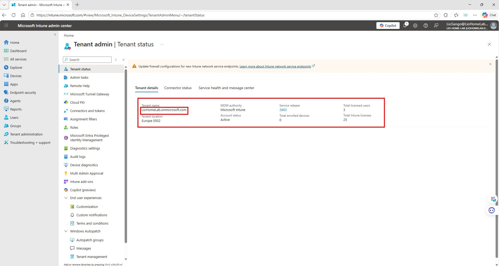

With the tenant confirmed, I set up the user accounts (Yosco and Paddy) in Entra ID, assigned them Business Premium licenses, and created a security group called `Intune-Managed-Devices`. Using a group rather than targeting users directly is how real environments work — you never assign policies to individuals if you can avoid it.

The enrollment itself went through three VM attempts before it worked. Hyper-V with a leftover domain join from a previous project caused repeated issues — the Azure AD join option simply doesn't appear on a domain-joined machine. VMware with a clean Windows 11 Pro install resolved it immediately. The enrollment path was: Settings → Accounts → Access work or school → Join this device to Azure Active Directory → sign in as Yosco.

After restart and signing in with Yosco's account, the device showed up in Intune as `DESKTOP-IR81EQP` within a few minutes.

**Screenshot 2a — Device enrolled, shown in Windows Settings:**
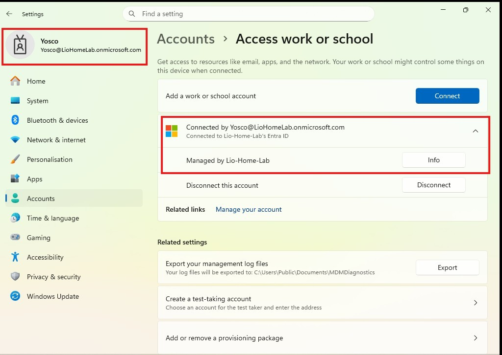

**Screenshot 2b — Device confirmed in Intune portal, compliance status shown:**
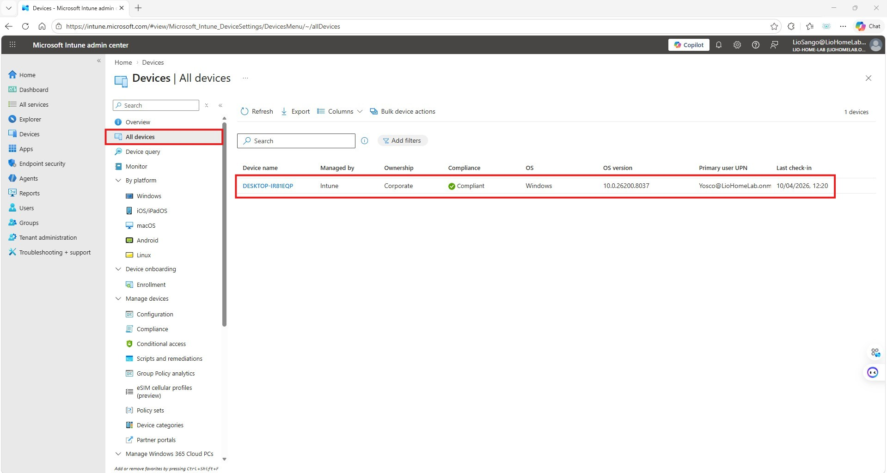

---

## Phase 2 — Compliance Policies and Remediation

Enrollment alone doesn't mean much. The device needs to meet a defined security standard before it should be trusted with company resources. That's what compliance policies are for.

I created `Windows-Compliance-Policy-Lab` targeting Windows 10 and later, with the following requirements:

- BitLocker encryption: Required
- Firewall: Required
- Antivirus: Required
- Real-time protection: Required
- Microsoft Defender Antimalware: Required
- Minimum OS version: 10.0.19041

**Screenshot 3 — Compliance policy settings showing security requirements:**
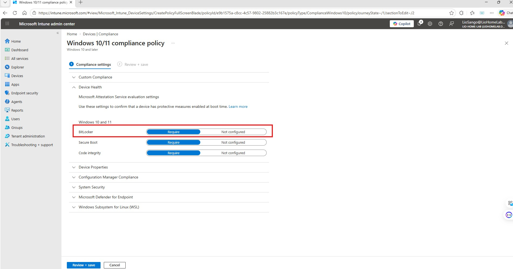

**Screenshot 4 — Policy assigned to Intune-Managed-Devices group:**
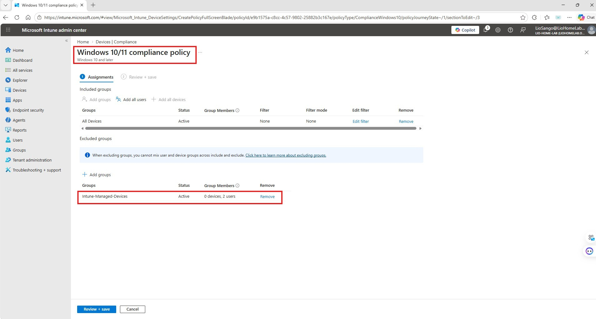

One setting that caused a policy error was Secure Boot. VMware VMs can't reliably report Secure Boot status to Intune — it's a known hardware reporting limitation specific to virtualised environments. In a production deployment with physical devices, this setting would be enforced. I disabled it for the lab scope and documented it as a limitation.

After forcing a sync, the device immediately showed as non-compliant. The reason was straightforward: BitLocker was not enabled on the VM.

**Screenshot 5 — Device flagged as non-compliant in Intune:**
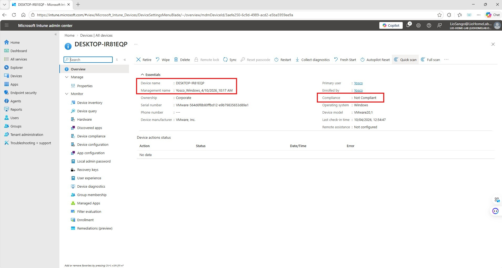

To confirm the root cause, I ran `manage-bde -status` on the VM, which showed exactly what Intune was detecting:

```
Protection Status:    Protection Off
Conversion Status:    Fully Decrypted
Percentage Encrypted: 0,0%
```

**Screenshot 6 — BitLocker status confirming non-compliance:**
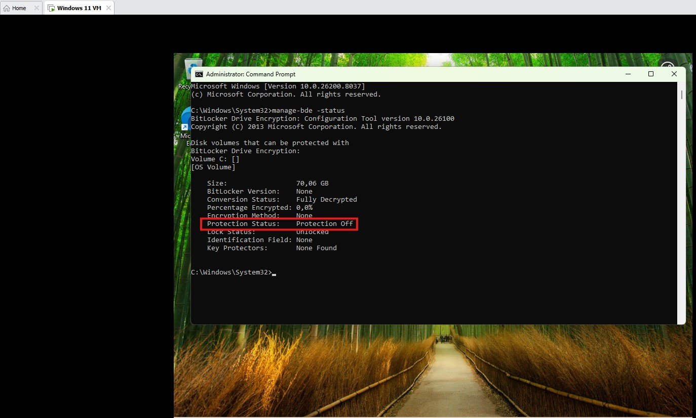

**Remediation:** I enabled BitLocker on the C: drive through Control Panel → BitLocker Drive Encryption, saved the recovery key to the Microsoft account, and let encryption run. VMware VMs encrypt quickly since they only process used disk space.

**Screenshot 7 — BitLocker encryption in progress:**
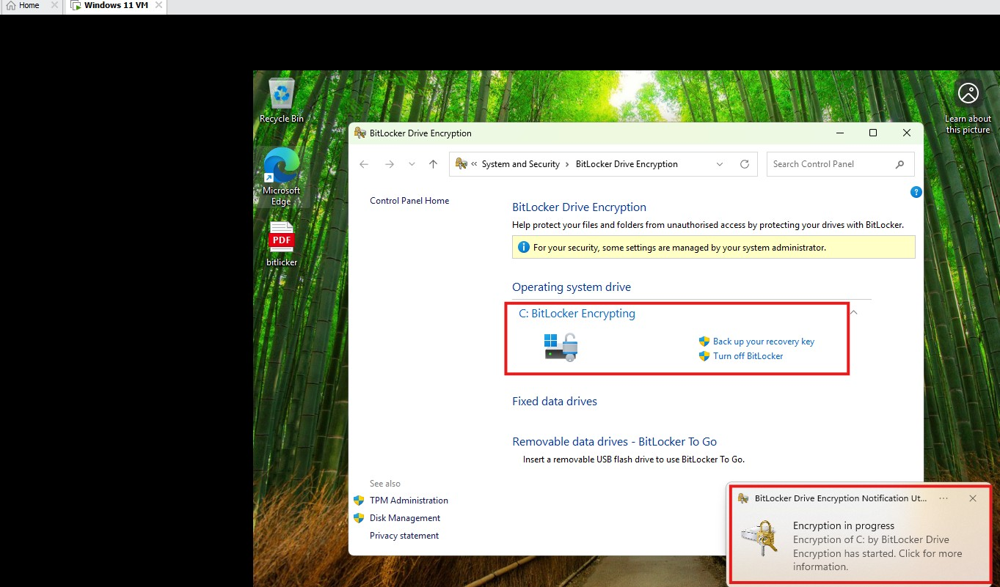

Once encryption completed, running `manage-bde -status` again confirmed:

```
Protection Status:    Protection On
Conversion Status:    Used Space Only Encrypted
Percentage Encrypted: 100,0%
Encryption Method:    XTS-AES 128
```

**Screenshot 8 — BitLocker fully enabled and protecting the drive:**
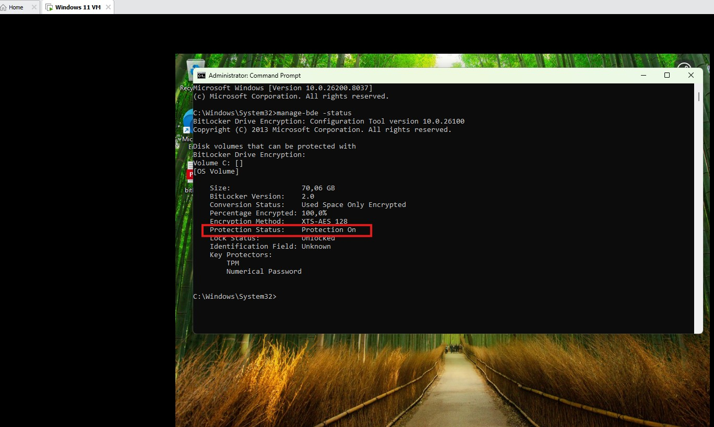

After forcing a sync from both the device and the portal, compliance status updated to Compliant.

**Screenshot 9 — Device now shows Compliant in Intune:**
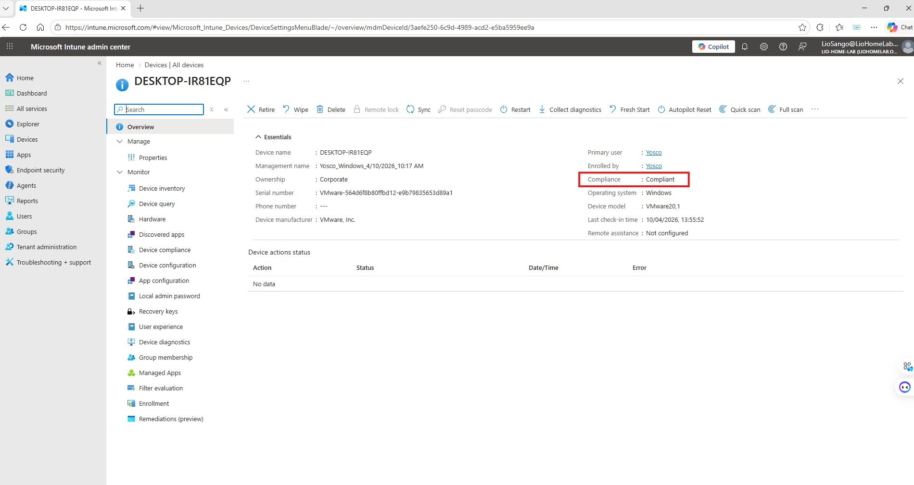

This non-compliant → remediated → compliant cycle is the core of what endpoint compliance management looks like day to day. Finding a device that's out of policy, identifying the specific setting causing it, fixing it, and watching the status update. I documented it deliberately because that's what an interviewer asking about endpoint management actually wants to know you've done.

---

## Phase 3 — Conditional Access: Zero Trust in Practice

Compliance policies on their own are just reports. The enforcement happens when you connect them to Conditional Access — a device that fails compliance should not be able to access company resources, period.

I created a Conditional Access policy in Entra ID called `Require-Compliant-Device` with the following logic:

- **Users:** Yosco and Paddy
- **Target resources:** All cloud apps
- **Condition:** `device.isCompliant -eq False` (filter for non-compliant devices)
- **Access controls:** Block access

One important prerequisite: Security Defaults must be disabled before Conditional Access policies can be enabled. Security Defaults and Conditional Access are mutually exclusive — Microsoft builds them this way because CA policies replace Security Defaults with more granular, organisation-specific rules.

**Screenshot 10 — Conditional Access policy configured with compliance filter:**
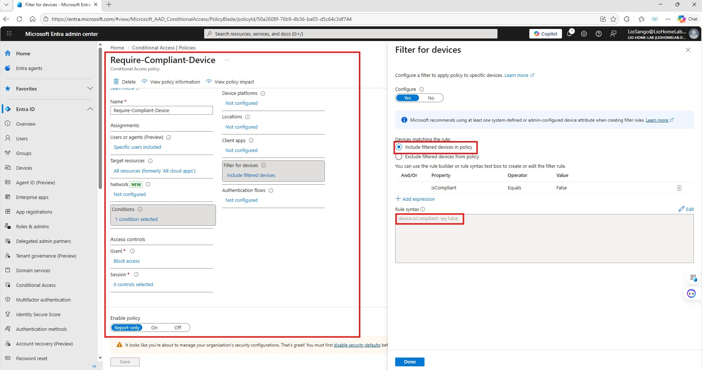

**Test 1 — Compliant device gets access:** Signed into portal.office.com from the enrolled VMware VM (DESKTOP-IR81EQP, Yosco's session). The M365 portal loaded normally with all apps accessible.

**Screenshot 11 — M365 access granted from compliant device:**
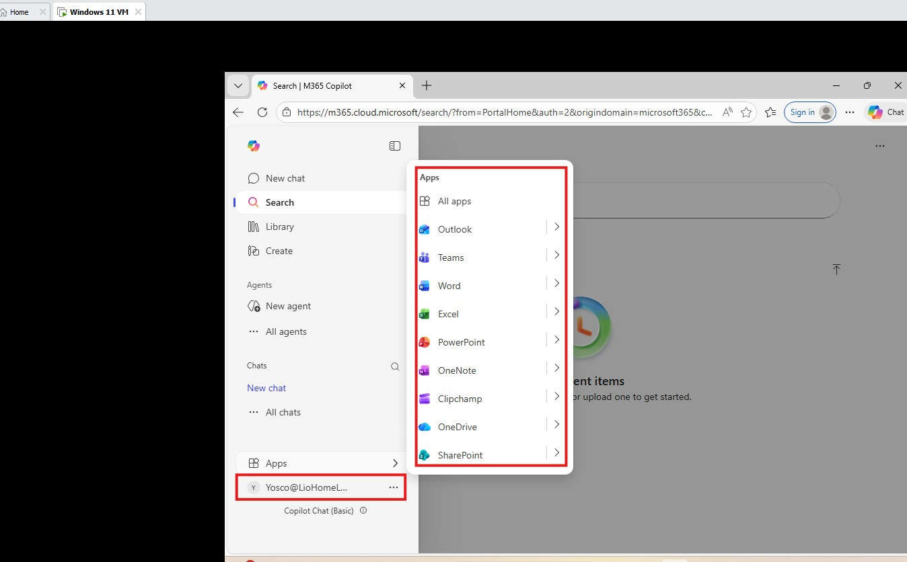

**Test 2 — Non-compliant device gets blocked:** Opened an InPrivate browser window on the host machine (not enrolled in Intune) and attempted to sign in with Yosco's credentials. The result:

> *"You cannot access this right now. Your sign-in was successful but does not meet the criteria to access this resource."*

**Screenshot 12 — Access blocked from non-enrolled device:**
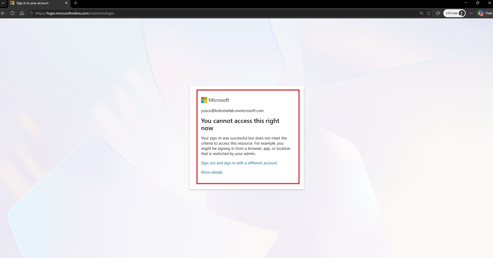

The authentication succeeded — Yosco's credentials are valid — but the device didn't meet the compliance requirement, so access was denied. That distinction matters. This isn't about password strength or MFA; it's about the device itself being a trusted, managed endpoint. That's what zero-trust means at the device layer.

---

## Phase 4 — Security Baseline and Update Management

With compliance and access control in place, the next layer was hardening — pushing a security baseline to the enrolled device and controlling how Windows updates are deployed.

### Security Baseline

I deployed the Windows 365 Security Baseline profile (`Windows-Security-Baseline-Lab`) from Intune's Endpoint Security → Security Baselines section. Microsoft's baseline is mapped to CIS controls and covers areas including Administrative Templates, Auditing, Data Protection, Defender, Device Guard, Device Lock, Firewall, and Lanman Workstation settings.

Rather than customising every setting, I deployed the baseline as-is. That's actually the correct approach for a first deployment — you establish the Microsoft-recommended configuration first, then adjust based on operational feedback. Organisations that customise baselines without understanding the defaults first usually end up with gaps.

**Screenshot 13 — Security baselines available in Intune:**
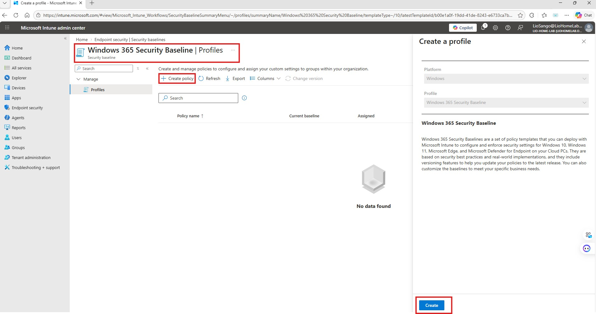

**Screenshot 14 — Baseline assigned to Intune-Managed-Devices group:**
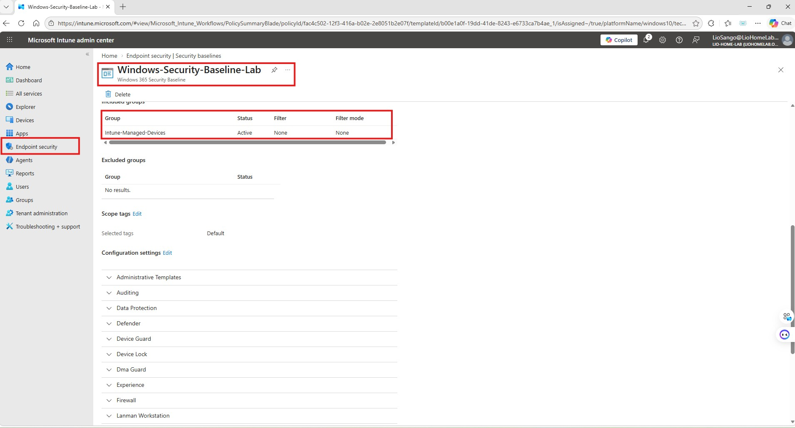

### Update Rings

I configured a Pilot update ring (`Update-Ring-Pilot`) with:

- Quality update deferral: 7 days
- Feature update deferral: 30 days
- Servicing channel: General Availability Channel
- Automatic update behaviour: Auto install and restart at maintenance time
- Active hours: 8 AM – 5 PM

The 7-day quality deferral means security patches are applied one week after Microsoft releases them. That window gives organisations time to spot issues before rolling out company-wide. The 30-day feature deferral on major OS updates is standard practice — you want stability in production, not day-one feature releases on managed endpoints.

**Screenshot 15 — Update Ring Pilot configured with deferral settings:**
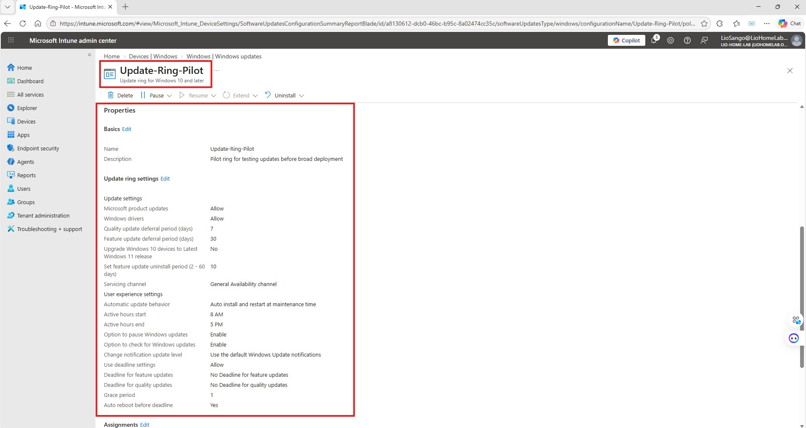

---

## Phase 5 — Application Deployment

App deployment in Intune splits into two categories that are worth understanding separately: apps you can deploy with the built-in wizard, and apps that need to be packaged first.

### Microsoft 365 Apps (Built-in Deployment)

For the M365 suite, Intune has a native deployment type that handles everything — you pick your apps, choose an update channel, set architecture, and Intune distributes it to enrolled devices. I deployed: Access, Excel, OneNote, Outlook, PowerPoint, Publisher, Teams, and Word on the Monthly Enterprise Channel (64-bit).

**Screenshot 16 — M365 Apps deployment configured in Intune:**
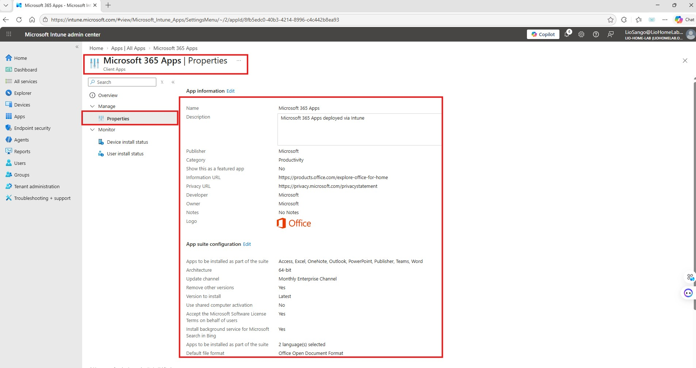

### 7-Zip Win32 App Deployment

This one required actual work. Intune can't deploy raw `.exe` or `.msi` files directly — they need to be packaged into the `.intunewin` format using Microsoft's Win32 Content Prep Tool (`IntuneWinAppUtil.exe`).

**Packaging process:**

1. Created folder structure: `C:\IntuneApps\7zip\Source\` and `C:\IntuneApps\7zip\Output\`
2. Downloaded 7-Zip installer (`7z2600-x64.exe`) into the Source folder
3. Ran the packaging tool:

```cmd
IntuneWinAppUtil.exe -c "C:\IntuneApps\7zip\Source" -s "7z2600-x64.exe" -o "C:\IntuneApps\7zip\Output"
```

4. Output: `7z2600-x64.intunewin` (1.599 KB encrypted package)

**Screenshot 17 — .intunewin package created in Output folder:**
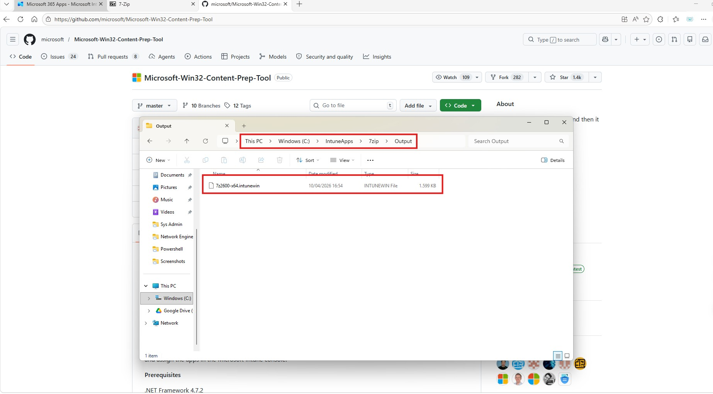

**Upload and configuration in Intune:**

- App type: Windows app (Win32)
- Install command: `7z2600-x64.exe /S`
- Uninstall command: `MsiExec.exe /X{23170F69-40C1-2702-2600-000001000000} /qn`
- Detection rule: File exists — `C:\Program Files\7-Zip\7zFM.exe`
- Assignment: Required for Intune-Managed-Devices

**Screenshot 18 — 7-Zip Win32 app review before creation:**
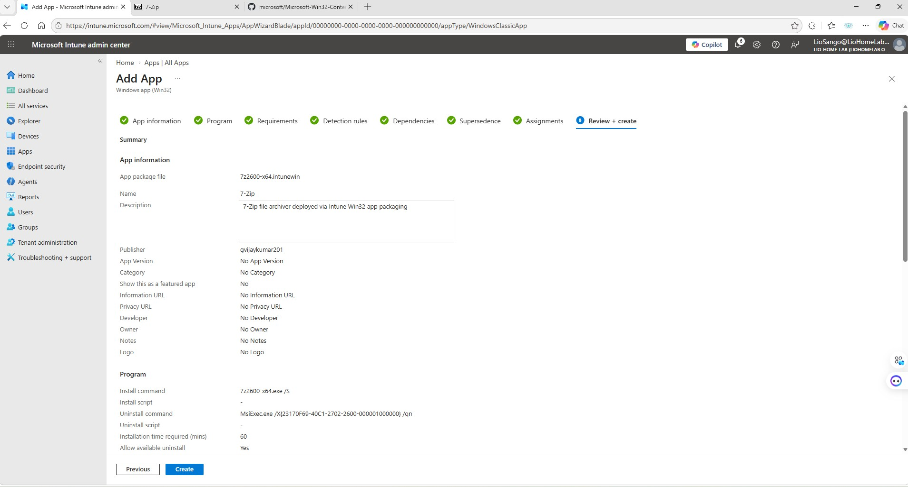

**Screenshot 19 — Both apps deployed and visible in All Apps:**
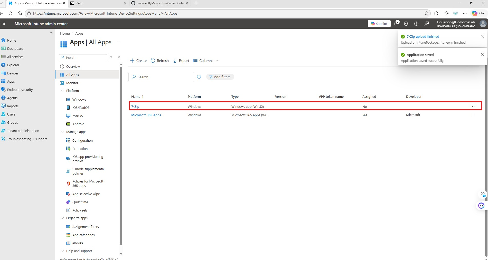

The silent install flag (`/S`) is what makes this work without user interaction. Intune deployments must be fully silent — any app that tries to launch a GUI installer will fail. Testing silent install parameters before packaging saves a lot of troubleshooting time.

---

## Phase 6 — Mobile Application Management (MAM)

Not every device in an organisation is fully managed. Contractors, personal phones, temporary workers — these all represent a BYOD scenario where you can't enroll the device into MDM but you still need to protect company data accessed through it.

MAM without enrollment is the answer. The policy wraps specific apps (Outlook, Teams, OneDrive) with data protection controls, without touching anything else on the device.

I created `MAM-Android-BYOD-Policy` targeting the Android platform with the following controls:

- Send org data to other apps: Policy managed apps only
- Receive data from other apps: Policy managed apps only
- Block backup to Android backup services
- Encrypt org data: Required
- Save copies of org data: Blocked
- Restrict cut/copy/paste: Policy managed apps with paste-in
- PIN for access: Required (numeric, min 6 digits, no simple PIN)

**Screenshot 20 — MAM policy assignments:**
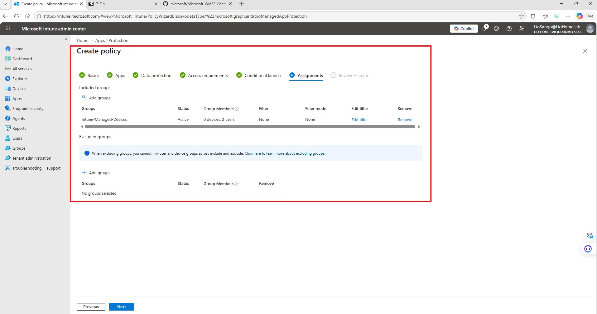

**Screenshot 21 — MAM policy active in Apps → Protection:**
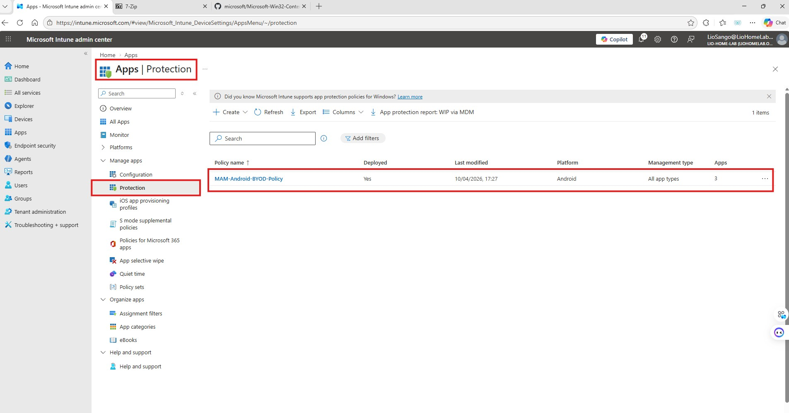

The practical effect: if Yosco opens Outlook on a personal Android phone and signs in with their LioHomeLab account, they can read company email — but they can't copy content to WhatsApp, save attachments to Google Drive, or take screenshots in the Outlook app. The company data is contained within the policy-managed app boundary. The personal side of the phone is completely untouched.

---

## Phase 7 — Reporting and Compliance Dashboard

The final piece was verifying everything from the portal's perspective and capturing the compliance state as evidence of a working environment.

**Screenshot 22 — Compliance policy showing 1 compliant device:**
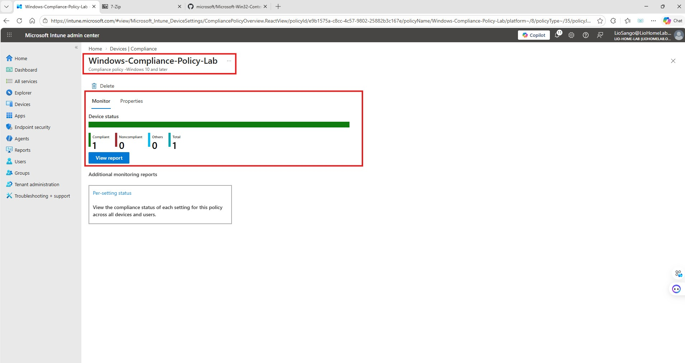

**Screenshot 23 — Device inventory showing DESKTOP-IR81EQP as Compliant:**
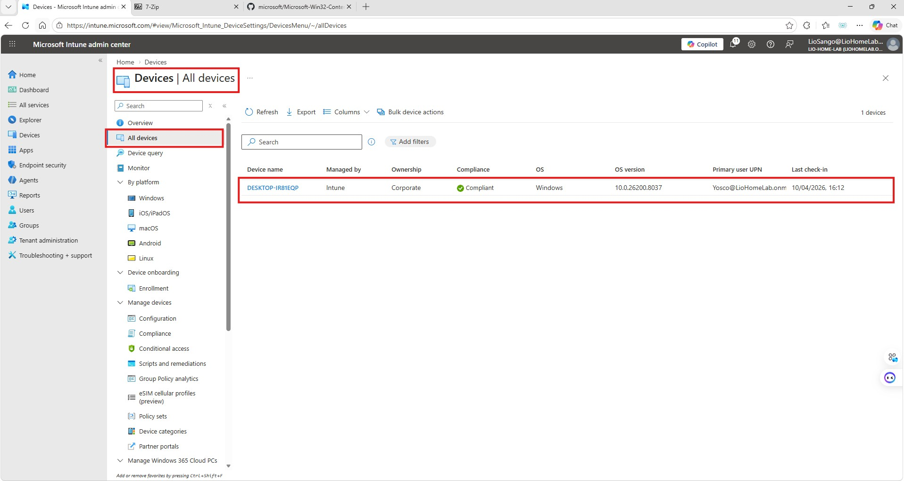

**Screenshot 24 — Compliance policy overview:**
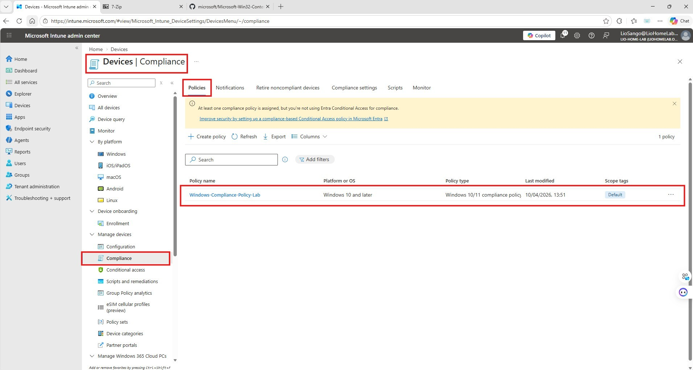

The compliance dashboard shows 1 Compliant, 0 Noncompliant — which is the correct end state. The journey to get there (device enrolled → non-compliant detected → BitLocker enabled → compliant confirmed → CA enforcing access) is documented across screenshots 2 through 12.

---

## Project Summary

| Component | Status |
|-----------|--------|
| Tenant setup and MDM authority | Done |
| Device enrollment (VMware Win11 Pro) | Done |
| Compliance policy (BitLocker, Firewall, AV) | Done |
| Compliance remediation cycle documented | Done |
| Conditional Access (compliant device required) | Done |
| Security baseline (Windows 365) | Done |
| Update Ring (Pilot — 7/30 day deferrals) | Done |
| M365 Apps deployment (built-in) | Done |
| 7-Zip Win32 deployment (.intunewin packaging) | Done |
| MAM Android BYOD policy | Done |
| Reporting dashboard | Done |

**Zero trust chain implemented:** Device enrolls → Compliance policy evaluates → Device becomes compliant (BitLocker remediated) → Conditional Access grants M365 access → Non-enrolled devices blocked at login.

---

## Lessons Learned

**Hyper-V and Intune enrollment don't mix well.** The Azure AD join option disappears entirely on domain-joined VMs, and Hyper-V has known issues with hardware hash extraction for Autopilot. VMware or Azure VMs are the better choice for Intune lab work. I spent more time troubleshooting Hyper-V enrollment than building the actual policies.

**Secure Boot is a known VMware limitation.** If you deploy a compliance policy requiring Secure Boot to a VMware VM, it will error — not fail compliance, but actually throw a policy error. The setting relies on hardware attestation that virtualised environments can't provide. Worth knowing before your first real deployment.

**Security Defaults must be disabled before enabling Conditional Access.** This isn't obvious from the portal. You'll create your CA policy, try to enable it, and hit a wall. They're mutually exclusive by design — CA replaces Security Defaults with custom rules. Disabling Security Defaults without immediately enabling CA policies would leave the tenant temporarily unprotected, so the order of operations matters.

**The Microsoft 365 Developer Program sandbox is currently restricted.** As of early 2025, free E5 dev tenant access requires either a Visual Studio Enterprise subscription or Microsoft partner program membership. Independent learners hit a "you don't qualify" wall regardless of account or browser. The Business Premium trial is a workable alternative — you get Intune, Entra P1, and Defender for Business, and it's fully cancelable before the 30-day billing period ends.

**Win32 app packaging is straightforward once you know the tool exists.** The `.intunewin` format and `IntuneWinAppUtil.exe` aren't well-advertised in Intune's own interface — it just mentions "Windows app (Win32)" as an option. Once you know the packaging step is required and have the tool, the actual process takes under five minutes for a simple application.

---

## Next Steps — Expanding This Project

**Windows Autopilot zero-touch deployment:** The logical extension of device enrollment automation. Autopilot lets you provision a new device directly from the factory — the user powers it on, signs in with their work account, and Intune automatically installs all policies and apps without IT touching the machine. Requires physical hardware or Azure VMs for the hardware hash enrollment step.

**iOS/iPadOS MAM policies:** This project covered Android BYOD. iOS MAM follows the same pattern but requires an Apple Push Notification certificate configured in Intune first. A physical iPhone or macOS Simulator would be needed to test the full enrollment flow.

**Vulnerability Management integration:** Intune's device compliance data feeds directly into Microsoft Defender for Endpoint's vulnerability management module when the connector is enabled. Connecting these two would allow risk-based compliance — a device with a critical CVE automatically becomes non-compliant.

**Multi-device compliance reporting:** With only one enrolled device, the compliance dashboard looks simple. Adding a second device with different configurations (one compliant, one intentionally non-compliant) would produce more meaningful reporting and demonstrate per-device compliance drill-down.

**PowerShell deployment via Intune:** Intune can push PowerShell scripts to enrolled Windows devices as a deployment mechanism. Combining this with the PowerShell automation scripts from Project 02 (AD onboarding/offboarding) would create an end-to-end provisioning workflow — Intune handles device enrollment and app deployment, PowerShell handles AD account creation.

---

## Related Projects

| Project | Description |
|---------|-------------|
| [Active Directory & Entra ID Deployment](../active-directory-lab) | Hybrid AD setup — the foundation this project's identity layer builds on |
| [Microsoft 365 Administration & IAM](../m365-administration-lab) | M365 tenant setup, MFA, and Conditional Access baseline |
| [PowerShell Automation for AD](../powershell-automation-lab) | Automation scripts for user lifecycle management |
| [Wazuh SIEM – Security Monitoring](../wazuh-siem-lab) | SIEM layer that could integrate with Intune compliance data |

---

